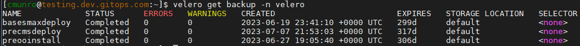

# GreenLight Group - How To - Backup EKS Cluster and ITOM resources 


---

> A complete backup should be taken before making any changes to the cluster 
> This process uses Ansible playbook automation to protect AWS resources including EKS Cluster, EFS, and RDS Databases

---

#### System Prep
These steps should be performed using the Cluster Control Node you want the backups created for

##### NOTES:
> Velero Backup Name must be unique with each execution or the playbook will fail  
> Ansible modules required:
> > community.aws  
> > ```ansible-galaxy collection install community.aws```  
> > kubernetes.core  
> > ```ansible-galaxy collection install kubernetes.core```  

- Playbook: aws-smax-upgrade-backup-all.yaml
- Required inputs: Cluster FQDN, Backup Name, RDS Snapshot Name

---

##### Steps to perform Cluster Backup

1. SSH Login to the **Control Node** for the Cluster to be backed up
2. Execute Ansible playbook

> To execute the playbook update the command below with the following values depending on your environment
> - full_name (FQDN of the cluster)
> - backup_name (Name used in Velero to identify the backup. **This must be unique**)
> - snap_string (Name used in AWS RDS to identify the backup/snapshot. **This must be unique**)
> > If this backup is to be taken in Production include the following additional input
> > - prod=true  
> The playbook uses an Ansible vault to retrieve AWS credentials and will require the use of a Vault Password

*Example Command for testing.dev.gitops.com*  
```
ansible-playbook /opt/glg/aws-smax/ansible/playbooks/aws-smax-upgrade-backup-all.yaml \
-e full_name=testing.dev.gitops.com \
-e backup_name=basesmaxdeploy \
-e snap_string=basesmaxdeploy \
--ask-vault-pass
```

*Example Command for smax-west.gitops.com*  
```
ansible-playbook /opt/glg/aws-smax/ansible/playbooks/aws-smax-upgrade-backup-all.yaml \
-e full_name=smax-west.gitops.com \
-e backup_name=postomt202205 \
-e snap_string=postomt202205 \
--ask-vault-pass \
-e prod=true
```

##### Steps to verify backup is complete

1. Verify Velero backup
```
velero get backup -n velero
```
Check for your backup and look for the STATUS 'Completed'  


2. Verify EFS backup
3. Verify RDS backup
