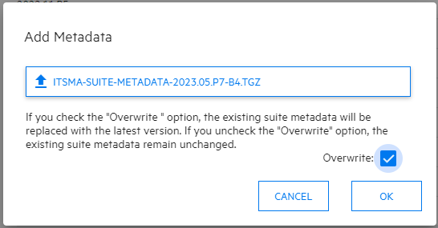
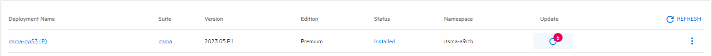
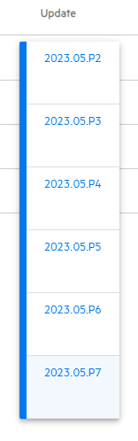
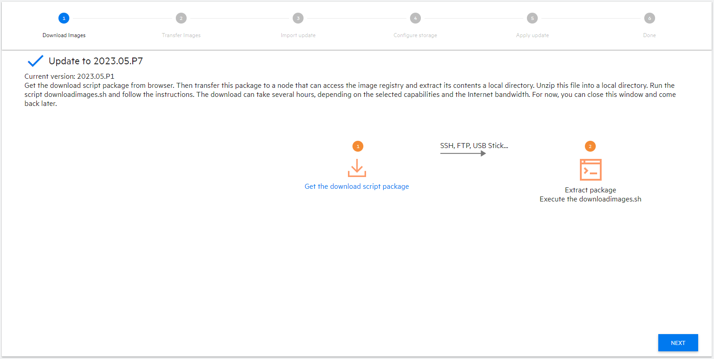
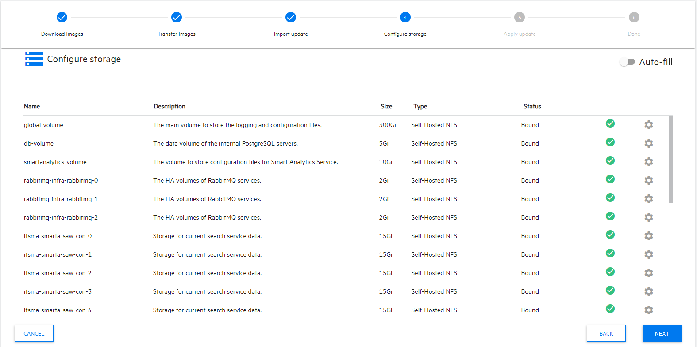
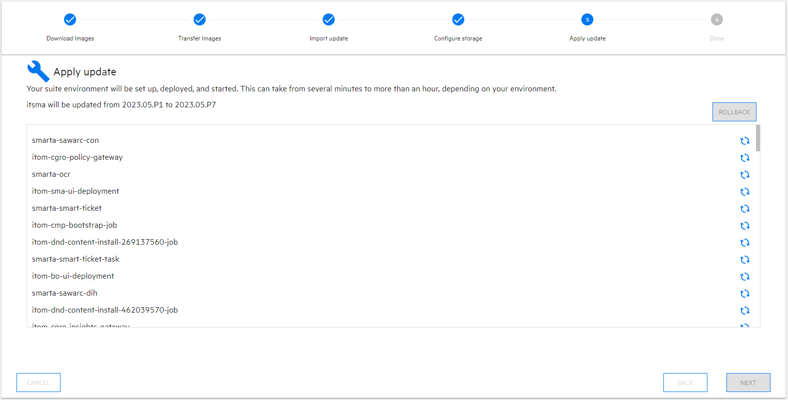

# GreenLight Group - How To
## GITOpS Deployment Documentation: SMAX 2023.05 Patch

#### Apply Patches to both OMT 2023.05 and SMAX 2023.05(.P1)
###### Upgrade OMT to 2023.05.P3 and SMAX to 2023.05.P7  
---

### Deployment Steps
> - Backup Cluster before making ANY changes
> - Create OMT upgrade working directory
> - Download and Extract OMT patch
> - Apply the OMT Patch
> - Download SMAX patch metadata
> - Upload SMAX patch metadata
> - Apply SMAX Patch

---

### Backup Cluster and SUITE before making any changes
> [AWS Backup Cluster](./AWS_Cluster-Backup.md)

### Create OMT upgrade working directory
Execute theses steps on the Control Node for the cluster  
```
mkdir -p ~/omt/2023.05.P3
```
### Download and Extract OMT patch
```
curl -gkLs https://owncloud.gitops.com/index.php/s/MhaCClFppEL6EhD/download -o ~/omt/2023.05.P3/OMT2305P3-15001.zip
unzip ~/omt/2023.05.P3/OMT2305P3-15001.zip -d ~/omt/2023.05.P3/
unzip ~/omt/2023.05.P3/OMT_2023.05.P3-30.zip -d ~/omt/2023.05.P3/
```

> #OneTimeOnly - Upload Images
> ansible-playbook /opt/glg/aws-smax/ansible/playbooks/aws-config-ecr-images.yaml -e full_name=testing.dev.gitops.com -e image_set_file=/opt/glg/aws-smax/BYOK/2023.05/2023.05_omt.P3-image-set.json
> ansible-playbook /opt/glg/aws-smax/ansible/playbooks/aws-config-ecr-images.yaml -e full_name=smax-west.gitops.com -e prod=true -e aws_region=us-west-2 -e region=us-west-2 -e image_set_file=/opt/glg/aws-smax/BYOK/2023.05/2023.05_omt.P3-image-set.json

### Apply the OMT Patch
```
cd ~/omt/2023.05.P3/OMT_2023.05.P3-30/
~/omt/2023.05.P3/OMT_2023.05.P3-30/patch.sh --apply
```

> #OneTimeOnly - Upload Images
> ansible-playbook /opt/glg/aws-smax/ansible/playbooks/aws-config-ecr-images.yaml -e full_name=testing.dev.gitops.com -e image_set_file=/opt/glg/aws-smax/BYOK/2023.05/2023.05_suite.P7-image-set.json


### Refresh ECR registry secret prior to patching
```
ansible-playbook aws-refresh-secrets.yaml -e full_name=smax-west.gitops.com -e prod=true --ask-vault-pass
```

### Download SMAX patch metadata
Download the SMAX patch metadata to load in OMT Management Portal  
> SMAX 2023.05.P7 - itsma-suite-metadata-2023.05.P7-b4.tgz 
- https://owncloud.gitops.com/index.php/s/14kd2rvajtlW5YV

#### Upload SMAX Patch metadata  
Login to the OMT Management Portal
- https://smax-west.gitops.com:5443

Navigate to the Metadata section
- Deployment --> Metadata  

Click 'ADD' and select the metadata file (downloaded in the previous step)  
- Ensure you check 'Overwrite' checkbox  

  

Once uploaded the deployments will show updates available  
  

Apply Patch  
- Follow the steps in the UI  

  
  

> IMPORTANT: If you do not refresh the registrypull secret you will not be able to see the images in the OMT Management Portal  

  

  

  


### Download and Extract CMS Patch
```
mkdir -p ~/cms/2023.05.P5
curl -kiL https://owncloud.gitops.com/index.php/s/eDpfauYAWG4xelD/download -o ~/cms/2023.05.P5/PH_212452_CMS_2023.05.P5_Containerized.zip
unzip ~/cms/2023.05.P5/PH_212452_CMS_2023.05.P5_Containerized.zip -d ~/cms/2023.05.P5/
tar -zxvf ~/cms/2023.05.P5/cms-helm-charts-1.8.5+20230505.452.tgz -C ~/cms/2023.05.P5/
```

> #OneTimeOnly - Upload Images  
> This only needs to be done once per AWS Environment, not per cluster 
```
/opt/cdf/tools/generate-download/generate_download_bundle.sh --chart ~/cms/2023.05.P5/cms-helm-charts/charts/cms-1.8.5+20230505.452.tgz -o hpeswitom -d ~/cms/2023.05.P5/
```
```
unzip ~/cms/2023.05.P5/offline-download.zip -d ~/cms/2023.05.P5/
cp ~/cms/2023.05.P5/offline-download/image-set.json /opt/glg/aws-smax/BYOK/2023.05/2023.05_cms.P5-image-set.json
```
> For Non-Prod AWS environments  
```
ansible-playbook /opt/glg/aws-smax/ansible/playbooks/aws-config-ecr-images.yaml -e full_name=testing.dev.gitops.com -e image_set_file=/opt/glg/aws-smax/BYOK/2023.05/2023.05_cms.P5-image-set.json
```
> For Production AWS environment
```
ansible-playbook /opt/glg/aws-smax/ansible/playbooks/aws-config-ecr-images.yaml -e full_name=smax-west.gitops.com -e prod=true -e aws_region=us-west-2 -e image_set_file=/opt/glg/aws-smax/BYOK/2023.05/2023.05_cms.P5-image-set.json
```

### Deploy CMS Patch
```
helm upgrade -n cms cms ~/cms/2023.05.P5/cms-helm-charts/charts/cms-1.8.5+20230505.452.tgz --reuse-values
```