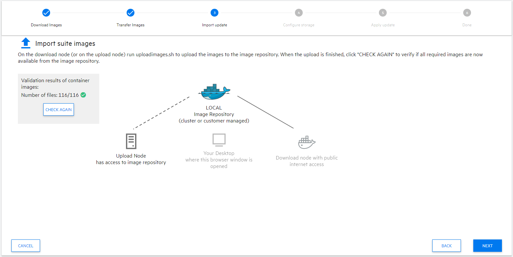

# GreenLight Group - How ToGITOpS Deployment Documentation: SMAX 2023.05 Patch 7 

#### Apply Patches to both OMT 2023.05 and SMAX 2023.05(.P1)

---

## Deployment Steps
> - Backup Cluster before making ANY changes
> - Create OMT upgrade working directory
> - Download and Extract OMT patch
> - Apply the OMT Patch
> - Download and Extract SMAX patch metadata
> - Upload SMAX patch metadata
> - Apply SMAX Patch

---

### Backup Cluster and SUITE before making any changes
> [AWS Backup Cluster](./AWS_Cluster-Backup.md)

### Create OMT upgrade working directory
```
mkdir -p ~/omt/2023.05.P3
```
### Download and Extract OMT patch
```
curl -gkLs https://owncloud.gitops.com/index.php/s/MhaCClFppEL6EhD/download -o ~/omt/2023.05.P3/OMT2305P3-15001.zip
unzip ~/omt/2023.05.P3/OMT2305P3-15001.zip -d ~/omt/2023.05.P3/
unzip ~/omt/2023.05.P3/OMT_2023.05.P3-30.zip -d ~/omt/2023.05.P3/
```

> #OneTimeOnly - Upload Images
> ansible-playbook /opt/glg/aws-smax/ansible/playbooks/aws-config-ecr-images.yaml -e full_name=testing.dev.gitops.com -e image_set_file=/opt/glg/aws-smax/BYOK/2023.05/2023.05_omt.P3-image-set.json
> ansible-playbook /opt/glg/aws-smax/ansible/playbooks/aws-config-ecr-images.yaml -e full_name=smax-west.gitops.com -e prod=true -e aws_region=us-west-2 -e region=us-west-2 -e image_set_file=/opt/glg/aws-smax/BYOK/2023.05/2023.05_omt.P3-image-set.json

### Apply the OMT Patch
```
cd ~/omt/2023.05.P3/OMT_2023.05.P3-30/
~/omt/2023.05.P3/OMT_2023.05.P3-30/patch.sh --apply
```

ansible-playbook /opt/glg/aws-smax/ansible/playbooks/aws-config-ecr-images.yaml -e full_name=testing.dev.gitops.com -e image_set_file=/opt/glg/aws-smax/BYOK/2023.05/2023.05_suite.P7-image-set.json





